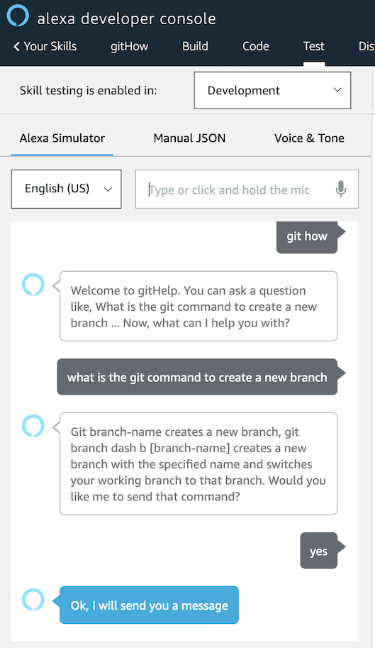

# Alexa Gits Me

This is an Alexa Skill that will answer user git questions and, if you want, send you a text with the command.
This is not intended to be Git in its entirety, but an easy reference to the main commands.

Invoke the skill by saying "git how".

## Software Requirements

[Software Requirements](Requirement.md)

## Project Management Board

* [Trello](https://trello.com/b/KSdLCHPI/githow)
* [Google Spreadsheets](https://docs.google.com/spreadsheets/d/1U_7U3_fGZcbkNivKYB3JFaBJ5h62fV1uw4VmhI6rFM4/edit?usp=sharing)

## User Stories

- _As a user_

  - I want to ask what is the command for a certain git action.
  - I want to hear what is the command for a certain git action.
  - I want a message sent to my phone so that I can see what it looks like, after I ask Alexa.

- _As a developer_
  - I want to create an Alexa skill that will answer a git question.
  - I want to give the user the correct git command to their git question.
  - I want to utilize Lambda functions as a way to adhere to SOLID principles.
  - I want to utilize an SNS Queue system to send a message to the user with the git command.

## Wireframes
  
[Decision Tree](https://app.moqups.com/uluAsPw28y/view/page/aa9df7b72)
* White board image


## Starting Project using Alexa Skills Kit Command Line Interface(ASK CLI)
* [Sign up for Alexa developer console](https://developer.amazon.com/) 
* Install Node.js and npm. ASK CLI needs Node.js version 6 or higher
* Setup AWS IAM user with required permissions: AWSLambdaExecute, AmazonSNSFullAccess, CloudWatchLogsFullAcess
* Install ASK CLI for mac: ```npm install -g ask-cli```, for window: ``` npm install -g --production windows-build-tools```
* The first time you use ASK CLI, you must use the ```ask init``` command to initialize ASK CLI 
* Use ```ask new``` to create new skill project
* Use ```ask deploy``` in the skill project directory to deploy it into alexa developer console
* Test the skill in console 
* To push the local changes to the remote version, use ```ask deploy``` or ```ask deploy --force``` 

## Output


## Resources
[BraveLemming](https://github.com/bravelemming)

[Tutorial](https://developer.amazon.com/blogs/alexa/post/a9ef18b2-ef68-44d4-86eb-dbdb293853bb/alexa-skill-recipe-making-http-requests-to-get-data-from-an-external-api) on how to make an Alexa Skill

[Free Code Camp](https://www.youtube.com/watch?v=QkbXjknPoXc)

[Github Repo](https://github.com/alexa/skill-sample-nodejs-fact) of how to build an Alexa Skill

[Medium.com](https://medium.com/@nils.backe/how-to-use-the-customer-profile-api-in-amazon-alexa-skills-671773c672f6) How to use the customer profile

[Dabble Lab](https://www.youtube.com/watch?v=f0JhqODTDY8) Handling Yes and No responses in Alexa Skills

[Publishing Messages](https://docs.aws.amazon.com/sdk-for-javascript/v2/developer-guide/sns-examples-publishing-messages.html) How to publish messages 


## Team Members

[sapanapoudel](https://github.com/sapanapoudel)

[Nhuuu](https://github.com/Nhuuu)

[rttgg](https://github.com/rttgg)

[BomiBear](https://github.com/bomibear)
